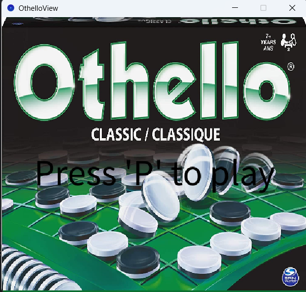
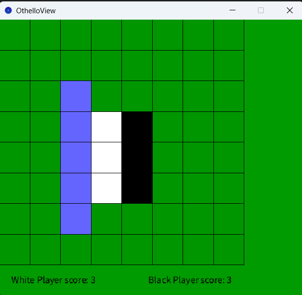
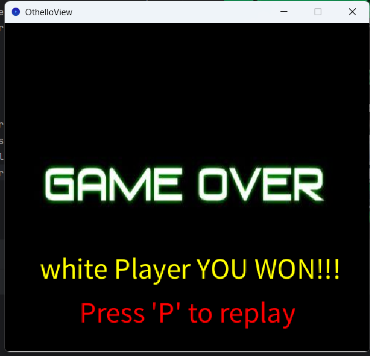

# OTHELLO GAME

## I - Das Program ausführen (Relativ Path)

#### I - 1 - Programm in IntelliJ starten
1. die main classe ausmachen und den Buttom Play Klicken um das Spiel zu starten
2. Um das Spiel zu starten, drücken Sie ('P').
3. Klicken sie in die lilane Felder, um dein Spieler zu erzeugen.


```bash
cd ...Verzeichnis\dieses\Projekts\auf\Ihrem\Computer
java --enable-preview -classpath "out;lib\core.jar;lib\controlP5.jar" launcher.S_C_Launcher
```

## II - Verwendete Bibliotheken

1 - "Processing" is a flexible software sketchbook and a language for learning how to code. Since 2001 [Mehr über "Processing"](https://processing.org/)

2 - "JUnit" ist ein Unit-Testing-Framework zum Schreiben und Ausführen wiederholbarer automatisierter Tests in Java. [Mehr über "JUnit"](https://mvnrepository.com/artifact/junit/junit)

## III - JShell
Das Jshell ist ein console womit man anders spielen kann.

```bash
cd C:\OthelloFinalEdition\

jshell.exe --enable-preview --class-path .\out\

var spiel = new othello.model.OthelloGame()


```

## V - Beschreibung

Othello ist ein klassisches Strategiespiel für zwei Spieler. Ziel des Spiels ist es, am Ende die meisten Boxen auf dem Spielbrett zu haben. Die Spieler wechseln sich ab, ihre Boxen auf dem Brett zu platzieren und dabei die Boxen des Gegners umzudrehen.

### V - 1 - Steuerung

##### V - 1 - a - Willkommen im Spiel
- Um das Spiel zu starten, drücken Sie 'Enter'(P).


##### V - 1 - b - Anleitung:

- Um das Spiel zu starten, drücken Sie 'P'.

##### V - 1 - c - Während des Spiels:

- um das Spiel zu unterbrechen, drücken sie auf G

##### V - 1 - d - Am Ende des Spiels:

- Drücken Sie auf 'P', um wieder zu spielen.


### V - 2 - Gameplay

- Die Spielsteine bewegen sich auf einem Spielfeld, und die Spieler platzieren abwechselnd ihre Steine, um die Steine des Gegners umzudrehen. 
- Ein gültiger Zug besteht darin, einen Stein in eine leere Zelle zu setzen, sodass mindestens ein gegnerischer Stein zwischen dem neu platzierten Stein und einem bereits vorhandenen Stein der eigenen Farbe liegt.
- Durch das Umdrehen von gegnerischen Steinen werden Punkte erzielt, und das Hauptziel ist es, am Ende des Spiels die Mehrheit der Steine auf dem Spielfeld zu besitzen.
- Das Spiel endet, wenn das Spielfeld voll ist oder kein Spieler mehr gültige Züge machen kann.
- Der Spieler mit den meisten Steinen seiner Farbe gewinnt das Spiel.


## VI - Screenshots

-  welcome screenshot
-  Anfang mit Spieler screenshot
-  Ende screenshot